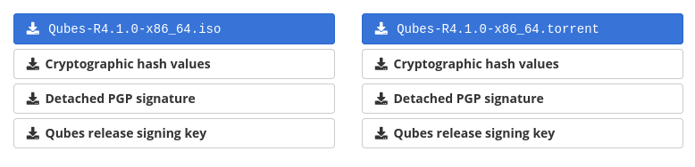
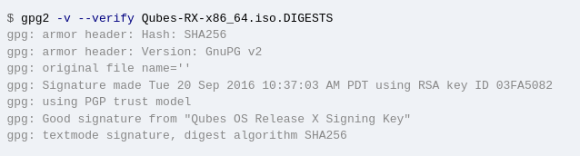
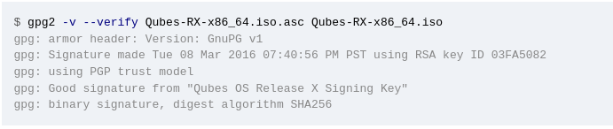
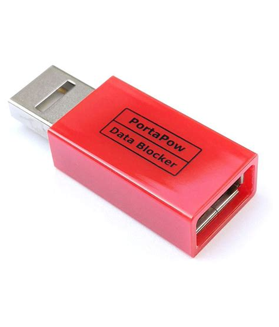
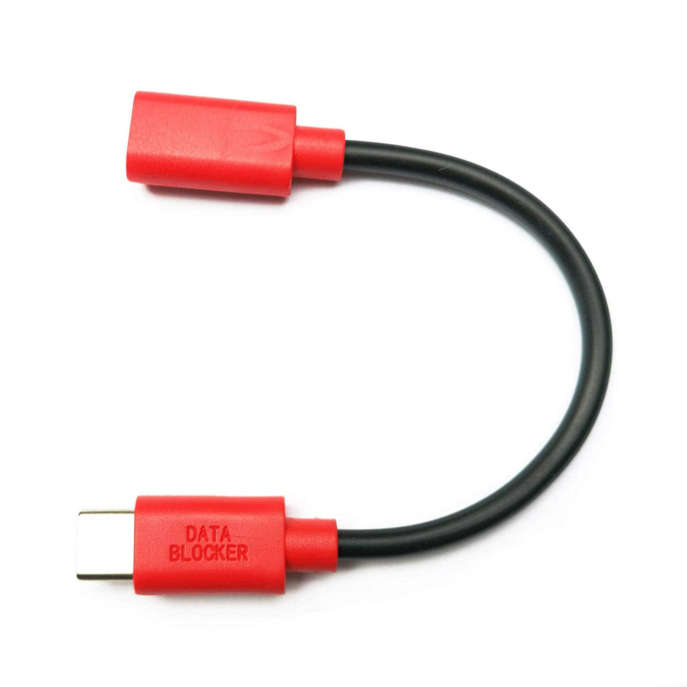

<div style="text-align:center;">
<p><i>“You never appreciate your anonymity until you don't have it anymore"</i></p>
</div>

<br>
<br>

The Guide
---------
*Note: Work in progress*

<br>

Well... I never thought i'd be making a guide so, here we go.... I guess....  
Let's define a few important things here:

`Adversary: Your threat.`

`Privacy: The act of your personal activities being hidden from public.`

`Security: The act of protecting yourself and online content such as files from either known and / or unknown adversary.`

`Anonymity: The act of hiding yourself to become indistinguishable from everyone else or simply "blending in".`

### Getting Started

_Disclaimer: This is for education / research._

<br>

##### Table of contents:

-\>> [Important Concepts](#important-concepts) <br>
  - -\> *[TOR](#tor)* <br>

-\>> [Proper Mindset](#proper-mindset) <br> 
-\>> [Knowing Your Adversary](#knowing-your-adversary) <br> 
-\>> [Setting Goals](#setting-goals) <br> 
-\>> [Creating Your Threat model](#creating-your-threat-model) <br> 
-\>> [Knowing Resources](#knowing-resources) <br> 
-\>> [Cleaning Up](#cleaning-up) <br> 

-\>> [Desktop](#desktop) <br>
  - -\>> [QubesOS](#qubesos) <br>
     - -\>> *[Installation](#installation)* <br>
     - -\>> *[Template Setup](#template-setup)* <br>
     - -\>> *[Onionizing Repositories](#onionizing-repositories)* <br>
     - -\>> *[Qubes Basic Setup](#qube-basic-setup)* <br>

-\>> [Creating our Aliases](#creating-our-aliases) <br>
-\>> [Secure Communications](#secure-communications) <br>
-\>> [Secure Hardware](#secure-hardware) <br>

<br>

#### __Important Concepts__

This guide requires you to understand various important concepts in order to truly be anonymous on the internet.
There is a vast array of concepts that will need to be thoroughly understood. 
You'll be able to make and choose your own model based upon this guide.

*   Understanding of TOR and its threats<!--(put link here) -->
*   Understanding benefits and negatives of a VPN <!--(PUT LINK HERE) -->
*   Understanding important privacy concepts <!--(PUT LINK HERE) -->
*   Understanding important security concepts <!--(PUT LINK HERE or make a section) -->
*   [Understanding the principles of thread modeling](https://invidious.esmailelbob.xyz/watch?v=DHZRhboZhfI)
*   Understanding how the internet functions

General Ideas:

- Using a VPN will *NOT* make you anonymous
- Just because you are using TOR does *NOT* mean you  are safe
- An adversary with enough time and resources will eventually find you
- The best way to hide is to not use the internet
- The land of compromises

<br>

##### TOR

TOR or The Onion Router was originally developed to keep U.S. military communications secure, and is now used world-wide to bypass censorship.
TOR will route your network traffic through 3 servers worldwide randomly.
``entry-node`` -> ``middle-node`` -> ``exit-node``.
This setup means that the ``entry-node`` will only have your IP address, the ``middle-node`` will only see the IP of ``entry-node`` __NOT__ your IP address.
``exit-node`` is the only node which will see *all* of your network traffic. 

Utilizing TOR with other ``.onion`` sites, means that neither your IP nor the servers IP address is exposed. Like your traffic going through 3 nodes or "hops", the a server running on the TOR network also goes through the same, meaning that the ``exit-node`` *cannot* see your network traffic.

With TOR, anyone is able to setup a node meaning that you cannot possible trust anything, which there are many issues including a malicious ``exit-node``, setup by an adversary in an attempt to de-anonymize users.
The TOR network is not as secure as many put it, there are a variety of attacks that can be used to de-anonymize users. An adversary can setup multiple malicious ``entry``, ``middle``, and ``exit`` nodes, then can DDoS other public TOR nodes which can either shut them offline or increase the already terrible speeds.
This could force a user to connect to the adversary's malicious nodes.
On a large DDoS scale, it is possible to be connected to all 3 malicious nodes, which would ultimately de-anonymize you. 

Many people argue against using VPNs with TOR, though there can be real-world benefits to having a setup like this.
If you are worried about an adversary knowing you are connecting to the TOR network this can be beneficial, but keep in mind your adversary can see you connect to the VPN.
If you are concerned about a malicious ``entry-node``, using a VPN can mask your IP address in this case.
If you are using an "amnesic" setup such as Tails or anon-whonix on QubesOS, you do not need to worry about having the same ``guard-node``.

<br>

#### __Proper Mindset__

Having the proper mindset when starting a process like this, is critical for success. You must be both willing and determined.

Here is a general thought process...

*   Always always always know what you are doing. You don't want to compromise yourself because you _thought_ you knew what you were doing. Make sure 100%. Do research **before**.
  
*   Have a strong mind. Most flaws are user error, meaning YOU. Having a strong mind is critical.
You must be in a clear state of mind, and almost be "talking to yourself" mentally.
Ask yourself before you do something "is this right".
A good memory is CRITICAL. You are going to need to remember almost **EVERYTHING** you do on the internet if you want to do this _"properly"._ 
Don't be compromised because you forgot something. 
Let's eliminate user error. 
More on this subject will be later in this _guide._
  
*   Take over-procedures. Don't "skimp" out on encryption because you don't feel like entering in a password. Don't be lazy.
  
*   Do not compromise your security for a friend. If they are your friend, they will respect your new-founded love for being secure.
  
*   Do not reveal more than you need to. MMJ doesn't need to know what you had for lunch.
  
(things to keep in mind)*   Reveal as little about yourself and origin as possible.
  
*   Remember - you can be identified by more ways than you can imagine.

*   Do not trust anyone.

*   Your life will change drastically.

*   Do not be lazy

People may think you are paranoid, but in a world like this it *is* useful to be even a bit paranoid. This will allow you to see the true realities of the world. If you are always thinking of ways you can be compromised, you'd actually likely reduce your risk due to the fact of you constantly thinking about it, rather than just "not really thinking" about it, or rather as often as you should. Privacy and security are constantly evolving, which means that you will have to evolve with it. Are you ready for a data breach? What are you going to do if your compromised? Questions like these are what you need to ask yourself in order to be successful, you must always have a backup plan that you can execute.

<br>

#### __Setting Goals__

We need to understand what we are trying to accomplish.

Think - what are you trying to do?

You need to properly identify a *threat model*, an *adversary* along with performing a self-analysis. You need to understand your own flaws.

<br>

#### __Creating your threat model__

The most important part of your setup.

Threat modeling can become an advanced topic, you will need to learn how to balance security, privacy and anonymity. You'll need to properly layout and identify what you are protecting yourself from.
Everyone has something to protect, whether it is passwords, location, internet activity, confidential documents, etc.
The items you are trying to protect will be referred here as "assets".

 Ask yourself these basic questions:

- What am I trying to protect?
- Who am I trying to protect this from?
- What happens if I fail to protect this?

These are some basic questions to ask yourself when creating your threat model.
Based upon your answers to these questions, will determine the route you must go.
Example - You don't want your neighbor Joe to see you sleeping, so you close your blinds.

Developing a threat model will require a lot of time and effort.
You will need to think of every possibility for your "assets".
Using your resources.
You will need to start documenting various tools and services will be a benefit to you, such as ProtonMail, TOR, Matrix, etc.
The tools and services will all depend on your threat model.

Examples:

- If you are trying to hide internet activity, then you would likely use a proxy, TOR, or a VPN.

- If you want to encrypt your emails, you would likely use a secure email provider and PGP.

- If you want to encrypt your communications, you would likely use an encrypted messenger.

Listed below are some useful resources for getting started.

- [Techlore Threat Modeling](https://tube.cthd.icu/watch?v=DHZRhboZhfI)
- [EFF Threat Modeling](https://ssd.eff.org/en/module/your-security-plan)

<br>

#### __Knowing Resources__

Along your journey, you'll need to have the proper resources at hand to deal with any sort of situation you will be facing.
Get yourself accustomed to these resources to better understand various conceptions and prepare yourself.

##### Common Tools:

- [PrivacyGuides](https://privacyguides.org)
- [PrivacyTools](https://privacytools.io)
- [PRISM Break](https://prism-break.org/)
- [Techlore - YouTube](https://invidious-us.kavin.rocks/channel/UCs6KfncB4OV6Vug4o_bzijg)
- [The Hated One - YouTube](https://invidio.xamh.de/channel/UCjr2bPAyPV7t35MvcgT3W8Q)

##### More:

- [Tor Project](https://torproject.org)
- [EFF](https://eff.org)

<br>

#### __"Cleaning Up"__

What is _"cleaning up"?_

Simply put, cleaning up is the process of deleting your various traces on the internet.
For the average person, this will be a long and arduous process.
You'll have to go through every single online account, email, activity, forum, message, game, etc. and literally delete *everything*.
This may seem extremely tedious - but remember, your adversary can easily find these data points and exploit them.

How to do this efficiently? Well... there is no "efficient" method, you just have to brute force this all of your data points have somewhat been eliminated.

You can first start by going to various apps that you are already signed into, start to delete all of your activities, message, posts and friends.
You'll have to do this for all of your "currently-known" services.
After you've done this, make sure everything is deleted including your PfP, and change your username, anonymize as much data as possible such as changing username, email and others.
After you've done this, you are now ready to delete this account.

As for finding services you may have forgotten, look through your entire email and find services you may have signed up for and start to do the same process.
Try to search up your commonly-used usernames to help you with this process.
Do this for every single account, just to ensure there is not anything that you may have missed.

There are some services which exist that can help expedite this process, though be aware of the risks involved in doing this. 


As for finding services you may have forgotten, look through your entire email and find services you may have signed up for and start to do the same process.
Often times, search for ``register``, ``registration``, ``welcome``.
These keywords are often times used.
Try to search up your commonly-used usernames to help you with this process.
Do this for every single account, just to ensure there is not anything that you may have missed.
There are some services which exist that can help expedite this process, though be aware of the risks involved in doing this.

Try to do searches on all of your identities and use this as a good way to help ensure that you've removed everything that you can.
Utilize services such as [HaveIBeenpwned](https://haveibeenpwned.com) to ensure you haven't suffered any data breaches and use Sherlock to help find some of your missed accounts.

Doing this in the real-world is just as important as online.
Your bank, local grocery store, etc. all share your information.
This is a big deal.

<br>

#### __Desktop__

Our desktop contains a massive amount of information.
This device should be both secure & private.
Without these 2 things, it can easily compromise you.
*What is the point of using a secure messenger, if your desktop is compromised by the same adversary you are protecting against via your secure messenger and they can see all of your activity?* 

A massive amount of information is stored on our desktop, meaning that it contains a trove of our personal information.
From search results to private documents.
These items are **NOT** private on "traditional" operating systems.

It is assumed that the average population is likely using Windows, Mac, or ChromeOS.
These are absolutely terrible options for privacy.
There are some efforts to "privatize" these operating systems, though due to the fact that they are all *closed-source*, means that many of these hardening methods that we would do, can just as easily fail if the OS itself is backdoored.
If you are new to the "operating system realm", a good replacement / dual-boot for these would be Fedora or Manjaro.
By "good", we assume the following: You are a beginner, you have little to none Linux experience or knowledge.
These choices have been made for the easy installation and low maintenance.

The operating system you choose should not be based upon what is recommended here, you yourself will need to research what is best suited for your situation and needs.

Those who are looking for some excitement or extremely into privacy, security and / or anonymity should look at [QubesOS](https://qubes-os.org) and [Tails](https://tails.boum.org) if you haven't already.

<br>

##### __QubesOS__

What is QubesOS? Simply put, QubesOS is a "reasonably secure operating system" and it will be the basis of our secure setup.
It uses a method known as "security by compartmentalization".
Simply put, most aspects of the OS are split into Qubes which can be thought of as virtual machines, meaning that if something gets compromised, the rest of the system can be safely used.
Due to the way QubesOS is built, requirements will be heavy.
Recommend at *least* 16GB of RAM with plenty of storage.
The official requirements can be found [here](https://www.qubes-os.org/doc/system-requirements/).

Why should we use QubesOS?

- It is commonly regarded as one of the most secure operating systems
- Provides amazing potential for creativity
- Still can be considered trusted even if a section is compromised
- Can heavily utilize TOR, proxies and VPNs

QubesOS gives us an amazing amount of customization that we can harness for security.
The sky is the limit with Qubes as it's based on VM's.
Nothing ever leaves each VM so, each activity can be compartmentalized for amazing security.

Things needed for setup & installation:

- [GnuPG](https://gnupg.org/download/index.html)
- At least an 8GB flash drive
- [Rufus](https://rufus.ie), [BalenaEtcher](https://www.balena.io/etcher/), or ``dd``


To first start off, [download](https://qubes-os.org/downloads/) the official ISO along with the digests.



To verify the ISO, run the command: <br>
```md5sum -c Qubes-RX-x86_64.iso.DIGESTS``` <br>
 which should output ``Qubes-RX-x86_64.iso: OK``.
 If not, it can mean either the download is corrupt or compromised.



To verifiy with GPG, run the following command: <br>
```gpg2 -v --verify Qubes-RX-x86_64.iso.asc Qubes-RX-x86_64.iso``` 

The output should read ``Good signature from "Qubes OS Release X Signing Key"``



After verifying the integrity of the ISO, you are now able to use your desired flashing software.
Ensure your flash drive is plugged in, and select it along with the ISO.
Your flash drive will be erased.
For Rufus users, select DD mode on format.

<br>

###### Installation

After booting to your installation medium click the "verify" option.
Afterwords, theres a few things we need to do.

- Set a *strong* encryption password.
This is super important! Make it strong
- Ensure __root__ is disabled
- Set a strong user account password

After you go through this, select "Begin Installation" and wait until it asks you to reboot.
Now you are ready for the final configuration.
Ensure you have all the Whonix options selected.
If you are using a desktop **do not** select the ``sys-usb`` option.
This will render your mouse and keyboard useless.
Use ``sys-usb`` on a laptop! For increased anonymity it is recommended to chose updates over TOR.
We also want our default qubes along with the default system qubes.

###### Qube Basic Setup

As for networking, if you have a VPN service such as ProtonVPN, you are able to utilize ``qtunnel`` and setup multiple VPNs.
For each of our VPN qubes, we will need a ``sys-firewall``.
If you wanted a dedicated ``sys-dns``, there are several guides on this:

- [qubes-dns](https://github.com/3hhh/qubes-dns)
- [Pihole  qube](https://github.com/92VV3M42d3v8/PiHole)

``sys-net`` -> ``sys-firewall`` -> ``sys-vpn`` -> ``sys-firewall-vpn``

We will now create additional qubes for our use.

- ``sys-net`` -> ``sys-firewall`` -> ``sys-firewall-email-personal`` -> ``personal-email`` - By placing the firewall here, this allows us to only whitelist internet traffic from specifically our email provider.

<br>

###### Template Setup

Templates are going to be the foundation of any QubesOS install.
As such, it should also be carefully configured.

You should not install all of your applications on a single template qube, instead you should have different templates for each purpose.
This is done as a security measure along with helping us with proper compartmentalization.
It's best to use minimal templates as most applications will likely not get used, but if you need more applications you can simply install them in a new template.
Ensure to read the [official documentation](https://qubes-os.org/doc/templates/minimal) for minimal templates.

The official minimal templates are available:
- Fedora
- Debian
- CentOS
- Gentoo

For installing templates:
dom0:
```
sudo qubes-dom0-update qubes-template-<DISTRO_NAME>-<RELEASE_NUMBER>-minimal
```

Suggested packages to install on the minimal template:

```
qubes-core-agent-passwordless-root
qubes-core-agent-dom0-updates
qubes-usb-proxy
qubes-gpg-split
```

Unofficial templates can be found on the QubesOS forum, and there is always the ability to build your own template from scratch.

Fedora-35:

```
sudo qubes-dom0-update qubes-template-fedora-35
```

Debian-11:

```
sudo qubes-dom0-update qubes-template-debian-11
```

When installing applications, it may be best to clone a minimal template and install the application on there for increased compartmentalization.

<br>

###### Onionizing Repositories

If you've opted to have updates over TOR, it is recommended that we also update our repositories on both dom0 and our templates.
Changing our repositories over TOR helps increase anonymity as we'd be connecting to the onion site instead of the clearnet.

dom0:

In dom0, edit ``/etc/yum.repos.d/qubes-dom0.repo`` and we will comment out the ``metalink`` and then uncomment the onion ``baseurl``.
After, update dom0 to ensure this is configured properly.

The same process above will take place in the ``/etc/qubes/repo-templates/qubes-templates.repo`` file.

Debian Templates:

Edit ``/etc/apt/sources.list``, comment out the clearnet repos and add the following:

```
2s4yqjx5ul6okpp3f2gaunr2syex5jgbfpfvhxxbbjwnrsvbk5v3qbid.onion/debian bullseye main contrib non-free

deb tor+http://5ajw6aqf3ep7sijnscdzw77t7xq4xjpsy335yb2wiwgouo7yfxtjlmid.onion bullseye-security main contrib non-free

#Optional Backports
deb tor+http://2s4yqjx5ul6okpp3f2gaunr2syex5jgbfpfvhxxbbjwnrsvbk5v3qbid.onion/debian bullseye-backports main contrib non-free
```

Fedora Templates:

Edit ``/etc/yum.repos.d/qubes-r[version].repo``, comment out the clearnet ``baseurl`` and uncoment the onion ``baseurl``

<br>

###### Qube Basic Setup

As for networking, if you have a VPN service such as ProtonVPN, you are able to utilize ``qtunnel`` and setup multiple VPNs.
For each of our VPN qubes, we will need a ``sys-firewall``.
If you wanted a dedicated ``sys-dns``, there are several guides on this:

- [qubes-dns](https://github.com/3hhh/qubes-dns)
- [Pihole qube](https://github.com/92VV3M42d3v8/PiHole)

``sys-net`` -> ``sys-firewall`` -> ``sys-vpn`` -> ``sys-firewall-vpn``

We will now create additional qubes for our use.

- ``sys-net`` -> ``sys-firewall`` -> ``sys-firewall-email-personal`` -> ``personal-email`` - By placing the firewall here, this allows us to only whitelist internet traffic from specifically our email provider.

- ``sys-net`` -> ``sys-firewall`` -> ``sys-firewall-IN-vpn-us-1`` -> ``sys-vpn-us-1`` -> ``sys-firewall-vpn-us-1`` - This again gives us the ability to whitelist traffic from only the ``sys-vpn-us-1``.

More:

- ``personal-web`` - Web Traffic
- ``personal-email`` - Email
- ``personal-dvm`` - Disposable
- ``personal-random`` - Random Web
- ``personal-social`` - Social Activity
- ``sys-personal-vpn`` - VPN for only ``personal``
- ``sys-firewall-personal`` - Firewall for only ``personal``
- ``personal-vault`` - Vault VM for only ``personal``

This can be used for a wide variety of activities, not just specifically "personal".
Your setup should take heavy use of the ``sys-firewall`` VM.
We can utilize the firewall to help maintain compartmentalization among our system.
The firewall can be useful for preventing data leaks & sniffing along with enforcing VPN policies.

<br>

###### "Splitting"

Let's startup by creating some basic qubes.
To start, clone ``vault`` and create ``pgp-keys`` and ``ssh-keys`` to store our keys securely.Both should have __no internet access__.
We will need to properly setup [split-pgp](https://qubes-os.org/doc/split-gpg) and [split-ssh](https://kushaldas/in/posts/using-split-ssh-in-qubesos-4-0.html).
Using the "split" method, we are able to create an additional [split-browser](https://github.com/rustybird/qubes-split-browser) and a [split-dm-crypt](https://github.com/rustybird/qubes-split-dm-crypt).

More thoughts:

- Split-Browser
- Split-Print

<br>

###### U2F-Proxy

Using [u2f-proxy](https://qubes-os.org/doc/u2f-proxy) allows you to "compartmentalize the browser in one qube and the USB stack in another so that they are always kept separate from each other".

The Qubes documentation shows the following for installation:

dom0:
```
sudo qubes-dom0-update qubes-u2f-dom0
```

Now, execute this command for all the Qubes you will utilize u2f.

```
qvm-service --enable QUBE_NAME qubes-u2f-proxy
```

To install on our templates, use the following:

Fedora: 
```
sudo dnf install qubes-u2f
```

Debian:
```
sudo apt install qubes-u2f
```

Finally, you must restart your Qubes.
It's suggested you read the [u2f-proxy](https://qubes-os.org/doc/u2f-proxy) documentation.

<br>

###### YubiKey

Using a YubiKey can help mitigate certain attacks such as password "snooping", along with increasing security.
Read the [official documentation](https://qubes-os.org/doc/yubikey).

Installation for template qubes:

Fedora:
```
sudo dnf install ykpers yubikey-personalization-gui
```

Debian:
```
sudo apt-get install yubikey-personalization yubikey-personalization-gui
```

The GUI on for Debian can be run via the ``yubikey-personalization-gui`` command.

- Choose ``configuration slot2``.
- Select ``HMAC-SHA1 mode: fixed 64 bit input``.
- Ensure to backup the ``Secret Key (20 bytes hex)``.


Now the following is required for dom0:
```
sudo qubes-dom0-update qubes-yubikey-dom0
```

If we had changed the name of ``sys-usb`` or are using something other than that, we would need to edit ``/etc/qubes/yk-keys/yk-vm'' in dom0.

- Paste the ``Secret Key (20 bytes hex)`` into ``/etc/qubes/yk-keys/yk-secret-key.hex`` in dom0.

- Paste your hashed password into ``/etc/qubes/yk-keys/yk-login-pass-hashed.hex`` in dom0.

To get your hashed password:

```
read -r password
```

```
echo -n "$password" | openssl dgst -sha1
```

Edit ``/etc/pam.d/login`` in dom0 and add:

```
auth include yubikey
```

Now, edit ``/etc/pam.d/xscreensaver`` to include:

```
auth include yubikey
```
<br>

###### GUI-VM

This is for advanced users.
Read the [official documentation](https://qubes-os.org/guivm-configuration).

<br>

###### Backups

Creating proper backups securely is critical for any setup, especially this one here.
You must understand the different backup techniques and solutions available.
For high security, it is recommended that we backup the system locally, meaning that we do not store our backups on the cloud.
We should start to look at possible backup solutions.
The built-in ``qvm-backup`` will work amazing for this.
It provides security & authentication, which are both crucial to a proper backup solution.
Ensure to read the [official documentation](https://github.com/qubes-os.org/doc/how-to-back-up-restore-and-migrate).

It's suggested you have a high-speed SSD or M.2 for this procedure.
There are "special" options described as "rugged", which has additional layer of armor and are generally waterproof.
Ensure this drive is also high-capacity.
In some cases, it may make sense to have an additional drive incase of failure or other malfunction.
Going into redundancy, you also have the ability to setup a local RAID on your network.
This would provide increased redundancy, though it can *potentially* decrease security, as having another system on the network, proper hardening, etc. but is unlikely to cause any harm with the proper configuration.
You could setup a local NextCloud instance or another type of local network storage and utilize [wyng](https://github.com/tasket/wyng-backup).

<br>

##### Creating our aliases

For setting our foundation, we are going to be creating a variety of aliases and each of these aliases are going to each need an "arsenal".
For step 1 we are going to need a password manager.

Upon creating our aliases we will have several different approaches:

1. Each username, email, and other will be completely random
2. Each alias will have its own email, username, etc.

We can generate an alias by thinking of a random word / phrase but this method could eventually compromise you if you keep choosing references from Star Trek.

If you are using QubesOS, we are able to utilize compartmentalization heavily in this instance. We will start off by creating multiple qubes for our setup.

- ``alias-web``
- ``alias-email``
- ``alias-untrusted``
- ``alias-messenger``
- ``alias-tor``
- ``alias-vault``
- ``alias-wallet``
- ``sys-firewall-alias``
- ``sys-vpn-alias``

By doing this for each alias, you have now setup an amazing solution for compartmentalization.
This only works if you utilize each qube for the specified task.
Ensure that nothing will leave the qube.
Ensure that all the ``alias`` qubes are properly routed via VPN or TOR to ensure proper setup.
For a more advanced setup, you are able to utilize Whonix qubes.
For each of our email addresses, we are able to setup email aliases using AnonAddy and SimpleLogin.

Each of our aliases is going to need some sort of "story".
We are not putting this story out to tell per say, but simply knowing basic information about our new alias would be important.
Information including age, country, special food, and activities.
We just need to make note of them, not giving any of this information away.
It's crucial to blend in, therefore some of this information may be used in conversation.Remember, each alias we create is different, therefore there should be absolutely no connection between any of them.
For each alias, you will need to "reset" your memory in a way.
You must be able to organize information you know from all of your aliases.
Grudges, friendships and other must not travel over, this is how you fail.

<br>

#### __Secure Communications__

Having a secure operating system is only 1 part that we need.
We need to ensure that all of our communications stay secure.
The most common method to this is using E2EE (End-to-end encryption).
This encrypts your messages locally on your device before sending them out.
Let's take a look at some of the basic types of messengers.

Centralized: Meaning there is a single server / point of failure.
If the server gets blocked you'll need to circumvent that.

Decentralized: Multiple servers, not a single authority meaning it's much more censorship resistent.

The main differences between centralized and decentralized is that a single authority cannot easily block a decentralized network as there is not a single server unlike centralized.Decentralized services are *sometimes* prone to leaking metadata and may cause issues when federated.

Here's a list of great messengers and services that you'll be able to use.

- [Signal](https://signal.org) A great messenger for friends & family.
Requires a phone number as it acts as a replacement to SMS / MMS.

- [Session](https://getsession.org) Censorship-resistent messenger.
A fork of Signal without the phone-number requirement.
Session has built-in onion-routing.

- [Matrix](https://matrix.org) Matrix provides a federated platform, which allows for anyone to host their own server, meaning that it is resistent to censorship.

<br>

#### __Secure Hardware__

You should not be trying to setup a secure system if the hardware itself cannot be trusted.Anything can be pre-loaded with malicious code designed to compromise security, especially how mass-production has been increasing over time, meaning they just need to compromise a device on the production line.

<br>

##### Basics

Here is a list of "everyday"-type carry / use.

USB Data Blocker: This USB device has the data pins removed from it, this sits from your USB female to your USB male, acting as a "middle man".
It's impossible for data to travel between.
Useful for public USB ports or untrusted devices.
Very useful if you're at an airport, hotel or other public area in which you need to charge a USB device.

<br>

[PortaPow USB Data Blocker](https://www.amazon.com/PortaPow-3rd-Gen-Data-Blocker/dp/B00QRRZ2QM/) - The gold standard of USB data blocking.
This is a USB-A connector with a built-in "SmartChip" designed to increase charging speeds.

<br>



<br>

[PortaPow Pure USB Data Blocker (Multicolored)](https://www.amazon.com/PortaPow-Pure-USB-Data-Blocker/dp/B07W928WRR/) - This USB-A Data Blocker is made of transparent plastic, meaning that you can physically verify that the data pins have been removed along with the removal of their "SmartChip".
Which will prevent an additional attack surface from being used.

<br>


<br>

[PortaPow USB-C to C Data Blocker](https://www.amazon.com/PortaPow-USB-C-Data-Blocker-Twin/dp/B082WDHS22/) - A USB-C cable that does not transfer any data.

<br>



<br>

[Malicious Cable Detector](https://hak5.org/products/malicious-cable-detector-by-o-mg) - Can be configured to detect malicious cables

Hardware Key: A small little device that can be used for MFA and GPG.
Very useful to have a physical device.
Something like this is recommended to have a backup clone and stored in a safe location such as a safe.

- Faraday Pouch - This will block all radio waves and signals, which can ensure that absolutely connectionn is traveling out of your devices.
It completely air-gaps the device.

<br>
